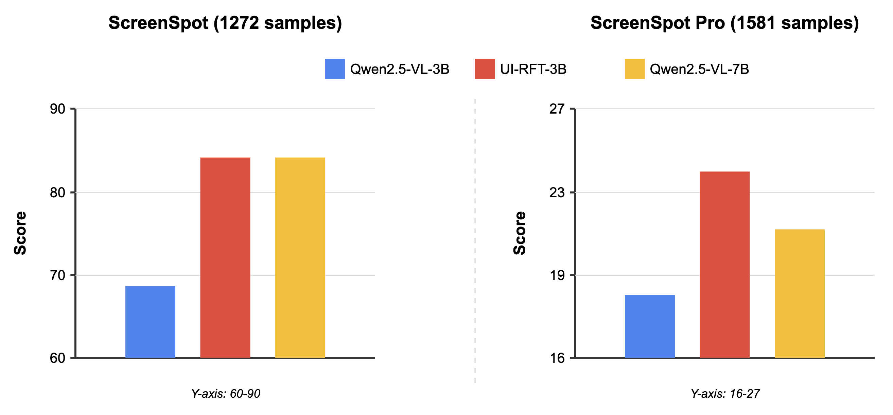

# UI-RFT: Reinforcement Fine-Tuning for GUI Grounding

 [[📖 Paper](https://arxiv.org/abs/2412.17589)] [[🤗 Checkpoints](https://huggingface.co/henryhe0123/UI-RFT-3B)] [[🤗 Datasets](https://huggingface.co/datasets/henryhe0123/UI-128)]

## 🔥 Overview

We introduce **UI-RFT**, the first framework utilizing rule-based RL to enhance VLMs' GUI grounding capabilities.

This work is the course project of CS3316 Reinforcement Learning.

飞书文档：https://yaf2qum85lq.feishu.cn/wiki/JDJOw9pcPiFTSJkUHbIcqBwpnXc
